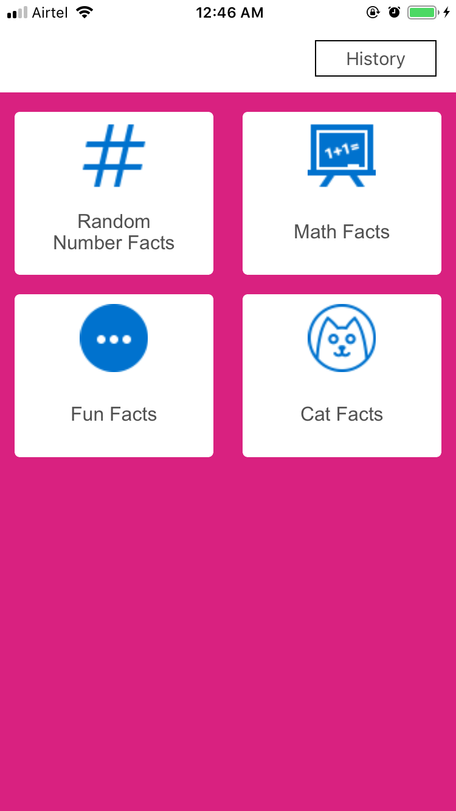
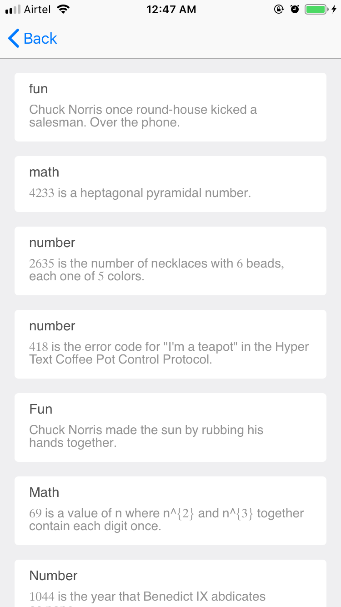
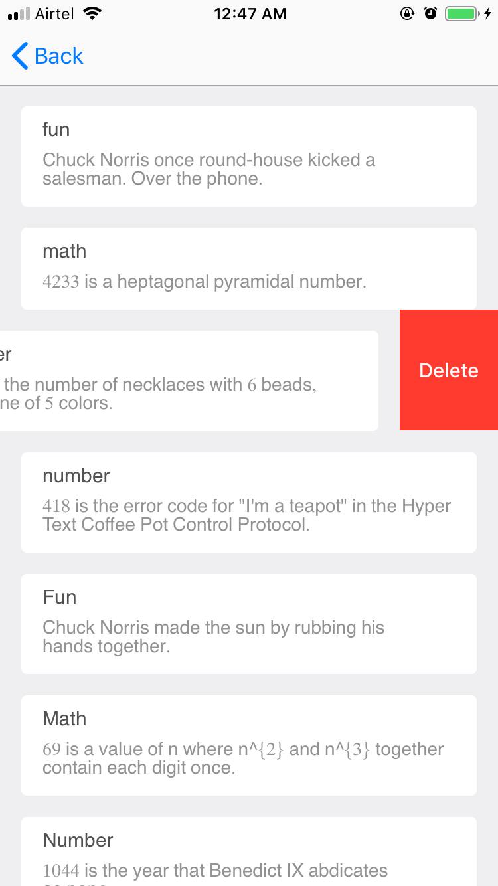

# Table of Contents
* App Description
* Project Details
* User Interface
* How to use

## App Description
This App help you gain knowledge by providing random interesting facts. App divides into four categories Number , Math , 
Jokes/Fun , Cat. App uses open API's for providing data.
App Homescreen will have the categories . Also these facts data are being saved in user history from where user can edit/delete
fact.

## Project Details
- The ViewControllers are using Collection View and TableViews for displaying data.
- Popup is being used when fact is fetched.
- Coredata is used to store User history and also for offline display of list.
- Network API's are used for each category data . 

## User Interface

###### Home page

###### A Random Fact

###### User History

###### Edit / Delete of Fact

## How to use
- Create New folder on desktop use "git clone https://github.com/Vasu05/Facts.git" in terminal.
- open FunFact.xcworkspace using XCode 10.1

